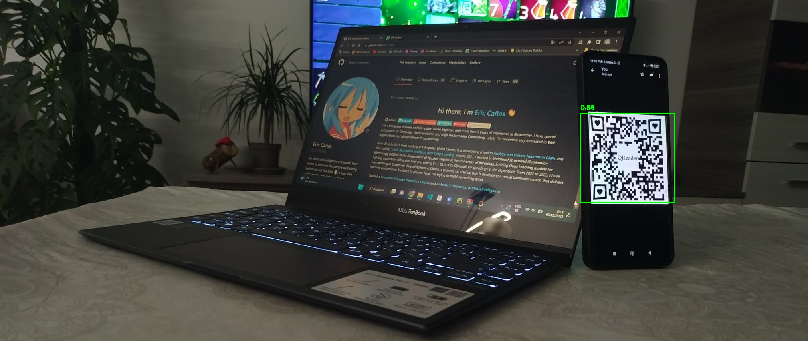

# QRDet
**QRDet** is a robust **QR Detector** based on <a href="https://github.com/WongKinYiu/yolov7" target="_blank">YOLOv7</a>.

**QRDet** will detect **QR** codes even in **difficult** positions or **tricky** images. If you are looking for a complete **QR Detection** + **Decoding** pipeline, take a look at <a href="https://github.com/Eric-Canas/qreader" target="_blank">QReader</a>.  

## Installation

To install **QRDet**, simply run:

```bash
pip install qrdet
```

## Usage

There is only one function you'll need to call to use **QRDet**, ``detect``:

```python

from qrdet import QRDetector
import cv2

detector = QRDetector()
image = cv2.imread(filename='resources/qreader_test_image.jpeg')
detections = detector.detect(image=image, is_bgr=True)

# Draw the detections
for (x1, y1, x2, y2), confidence in detections:
    cv2.rectangle(image, (x1, y1), (x2, y2), color=(0, 255, 0), thickness=2)
    cv2.putText(image, f'{confidence:.2f}', (x1, y1 - 10), fontFace=cv2.FONT_HERSHEY_SIMPLEX, fontScale=1,
                color=(0, 255, 0), thickness=2)
# Save the results
cv2.imwrite(filename='resources/qreader_test_image_detections.jpeg', img=image)
```



## API Reference

### QReader.detect(image, return_confidences = True, as_float = False, is_bgr = False)

- ``image``: **np.ndarray**. NumPy Array containing the ``image`` to decode. The image is expected to be in ``uint8`` format [_HxWxC_], RGB or BGR depending on the ``is_bgr`` parameter.
- ``return_confidences``: **bool**. If `True`, the output will be in the format ``(((x1, y1, x2, y2), confidence), ...)``. Otherwise, it will be in the format `((x1, y1, x2, y2), ...)`. Default: `True`. 
- ``return_confidences``: **bool**. If `True`, the returned coordinates will be returned as `float`, with the complete precision outputted from the **detection model**. Otherwise, they will be rounded to the closest integer. Default: `False`.
- ``is_bgr``: **bool**. If `True` the image is expected to be in ``BGR``. Otherwise, it will be expected to be ``RGB``. Default: `False`

- Returns: **tuple[tuple[tuple[int, int, int, int], float], ...] | tuple[tuple[int, int, int, int]]**: A tuple with the coordinates of all detected **QR** codes. If ``return_confidences`` is `True`, the output will look like: ``(((x1, y1, x2, y2), confidence), ...)``. If ``return_confidences`` is `False` it will look like: `((x1, y1, x2, y2), ...)`.

## Acknowledgements

This library is based on the following projects:

- <a href="https://github.com/WongKinYiu/yolov7" target="_blank">YoloV7</a> model for **Object Detection**.
